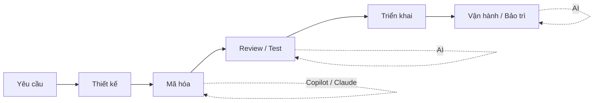
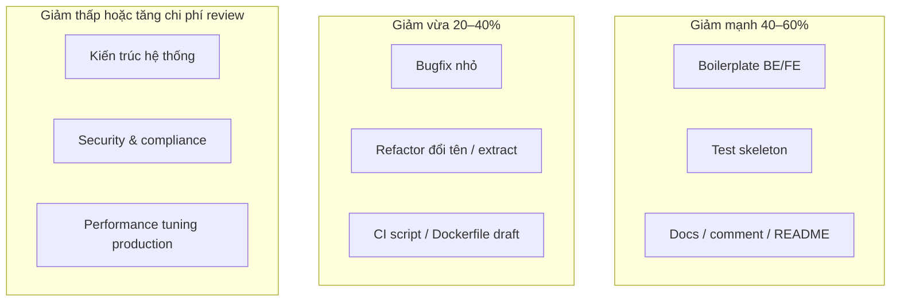

# Áp dụng AI vào phát triển phần mềm doanh nghiệp
## GitHub Copilot Enterprise vs Claude for Enterprise — Dự án RedBus

> **Cách dùng file này:** Mỗi `---` là một slide. Import vào PowerPoint/Google Slides, hoặc dùng [Marp](https://marp.app/) / VS Code extension "Marp for VS Code" để xuất PDF/PPTX.

---

# Slide 1 — Tiêu đề

**Áp dụng AI vào vòng đời phần mềm**  
GitHub Copilot Enterprise · Claude for Enterprise  
*Case study: Hệ thống RedBus (Spring Boot + React)*

Người trình bày: _______________  
Ngày: _______________

---

# Slide 2 — Mục tiêu buổi trình bày

1. So sánh **Copilot Enterprise** và **Claude Enterprise** cho team dev
2. **Ưu / nhược điểm** có dẫn chứng (nghiên cứu + doanh nghiệp quốc tế)
3. Tác động lên **phát triển · bảo trì · vận hành** (có AI vs không AI)
4. **Giảm nguồn lực** ở bước nào trong SDLC
5. **Chi phí đầu tư** và khung tính ROI gợi ý cho RedBus

---

# Slide 3 — Bối cảnh dự án RedBus

| Hạng mục | Công nghệ |
|----------|-----------|
| Backend | Java 17, Spring Boot 3, MyBatis, JWT, MySQL |
| Frontend | Vite, React 19, TypeScript, Axios |
| Phạm vi | Đặt vé, thanh toán, quản trị tuyến/xe, mail, bảo mật |

**Vì sao phù hợp thí điểm AI:** codebase có pattern lặp (CRUD, DTO, mapper, trang admin), tài liệu API, test — đúng điểm AI hỗ trợ mạnh nhất.

---

# Slide 4 — AI trong SDLC: không thay dev, mà gia tốc dev

**Nguyên tắc:** AI là *trợ lý*, con người chịu trách nhiệm kiến trúc, bảo mật và chất lượng cuối.

---

# Slide 5 — Hai hướng công cụ doanh nghiệp

| | **GitHub Copilot Enterprise** | **Claude for Enterprise** |
|---|------------------------------|---------------------------|
| **Điểm mạnh** | Gắn sâu GitHub, IDE, PR, agent trong repo | LLM mạnh, context dài, Claude Code, Cowork |
| **IDE** | VS Code, JetBrains, Visual Studio, Neovim… | Web, desktop, tích hợp IDE qua Claude Code |
| **Phù hợp** | Team đã dùng GitHub Enterprise, review PR tập trung | Team cần phân tích tài liệu, refactor lớn, đa công cụ |
| **Giá tham chiếu (2025–2026)** | **$39/user/tháng** (+ GitHub Enterprise Cloud) | **$20/seat/tháng** + **usage theo token API** |

*Nguồn: [GitHub Copilot pricing](https://docs.github.com/en/copilot/about-github-copilot/subscription-plans-for-github-copilot), [Claude pricing](https://claude.com/pricing)*

---

# Slide 6 — Chi phí đầu tư (TCO) — Hạng mục cần budget

### A. Chi phí license (định kỳ)
| Công cụ | Đơn giá (USD) | Ghi chú |
|---------|---------------|---------|
| Copilot **Business** | $19/user/tháng | Org GitHub, chưa đủ tính năng enterprise |
| Copilot **Enterprise** | $39/user/tháng | Audit, policy, knowledge bases; cần GHEC |
| Claude **Team** (Standard) | $20/seat/tháng (annual) | SSO, admin; Claude Code trên Premium seat |
| Claude **Team** (Premium) | $100/seat/tháng (annual) | 5× usage, Claude Code đầy đủ |
| Claude **Enterprise** | $20/seat + usage API | SCIM, audit logs, compliance API |

### B. Chi phí ẩn / một lần
- **GitHub Enterprise Cloud** (nếu chọn Copilot Enterprise): hàng chục USD/user/tháng tùy gói
- **Đào tạo & playbook** (prompt, review AI code): 2–5 ngày công × số senior
- **Governance:** policy AI, secret scanning, SBOM, checklist review
- **Từ 6/2026:** Copilot chuyển sang **AI Credits theo token** — cần theo dõi usage ([GitHub blog](https://github.blog/news-insights/company-news/github-copilot-is-moving-to-usage-based-billing/))

### C. Ví dụ nhanh — Team 5 dev (chỉ license AI)
| Phương án | Ước tính/năm (USD) |
|-----------|-------------------|
| Copilot Enterprise × 5 | 39 × 5 × 12 ≈ **$2,340** |
| Claude Enterprise × 5 (seat only) | 20 × 5 × 12 = **$1,200** + usage |
| Claude Team Premium × 2 senior + Standard × 3 | (100×2 + 20×3) × 12 ≈ **$3,120** |

*Usage Claude: heavy agent có thể thêm **$50–200/user/tháng** tùy mức dùng — nên đặt **spend cap** trong admin.*

---

# Slide 7 — Ưu điểm (có dẫn chứng quốc tế)

| Ưu điểm | Dẫn chứng | Nguồn |
|---------|-----------|-------|
| Viết code / tài liệu nhanh hơn ~50% | McKinsey: document code **−50% thời gian**, code mới **~−50%**, refactor **~−35%** | [McKinsey 2023](https://www.mckinsey.com/capabilities/tech-and-ai/our-insights/unleashing-developer-productivity-with-generative-ai) |
| Onboard codebase lạ nhanh hơn | Duolingo: **+25% tốc độ dev** với engineer mới vào repo | [GitHub customer story](https://github.com/customer-stories/duolingo) |
| Chất lượng cảm nhận tốt hơn | Thomson Reuters (case GitHub): **55% nhanh hơn**, **39% cải thiện chất lượng code** | [Copilot Business](https://github.com/features/copilot/copilot-business) |
| Junior được lợi nhiều hơn | CACM: junior dev **productivity gain lớn nhất**; acceptance rate dự báo hiệu quả | [Communications of the ACM](https://cacm.acm.org/research/measuring-github-copilots-impact-on-productivity/) |
| Quy mô adoption lớn | **20,000+ org**, ~**30%** suggestion được accept | [GitHub economic impact blog](https://github.blog/news-insights/research/the-economic-impact-of-the-ai-powered-developer-lifecycle-and-lessons-from-github-copilot/) |
| Văn hóa engineering (Shopify) | Copilot trở thành **chuẩn văn hóa dev**, đo adoption & downstream effects | [Shopify × GitHub (video)](https://www.youtube.com/watch?v=wVKBwcm5dbw) |

---

# Slide 8 — Nhược điểm & rủi ro (có dẫn chứng)

| Nhược điểm | Dẫn chứng | Nguồn |
|------------|-----------|-------|
| Code không an toàn / sai | ~**2/3** giải pháp LLM **sai hoặc có lỗ hổng**; ~**50%** code “đúng” vẫn **không an toàn** | [SecurityWeek / nghiên cứu LLM](https://www.securityweek.com/how-to-eliminate-the-technical-debt-of-insecure-ai-assisted-software-development/) |
| Technical debt tăng | MIT Sloan: productivity +55% nhưng **debt tăng** nếu thiếu oversight, đặc biệt brownfield | [MIT Sloan Review](https://sloanreview.mit.edu/article/the-hidden-costs-of-coding-with-generative-ai/) |
| Task phức tạp — lợi ích giảm | McKinsey: task **high complexity** — tiết kiệm **<10%**; junior đôi khi **chậm hơn 7–10%** | McKinsey 2023 |
| Metric ≠ cảm nhận | NAV IT (26k+ commit): **không thấy thay đổi commit activity có ý nghĩa** sau khi adopt Copilot | [arXiv 2025 case study](https://ui.adsabs.harvard.edu/abs/2025arXiv250920353S/abstract) |
| Shadow AI | ~**50%** dev dùng công cụ **không được IT duyệt** | SecurityWeek |
| Sự cố bảo mật | ~**1/5** tổ chức đã gặp sự cố nghiêm trọng liên quan **AI-generated code** | SecurityWeek |

**Kết luận:** Cần **review bắt buộc**, test, SAST — không merge “AI-first, human-never”.

---

# Slide 9 — So sánh vòng đời: CÓ AI vs KHÔNG AI

| Giai đoạn | Không AI (baseline) | Có AI (Copilot / Claude) | Delta thực tế (tham chiếu) |
|-----------|---------------------|--------------------------|----------------------------|
| **Phát triển tính năng mới** | Viết tay boilerplate, CRUD, UI form | Sinh mapper, DTO, component, hook | **−30% đến −55%** thời gian (task đơn giản–trung bình) |
| **Bảo trì / sửa lỗi** | Đọc code cũ, trace log | Explain code, đề xuất patch | **−20% đến −40%** (nếu dev hiểu domain) |
| **Vận hành** | Runbook thủ công, ticket | Draft runbook, query log, postmortem | **−15% đến −30%** tài liệu & phân tích |
| **Onboarding dev mới** | 2–4 tuần làm quen repo | Hỏi AI theo module, giảm ramp-up | Duolingo: **+25% velocity** |
| **Nợ kỹ thuật** | Tích lũy chậm | Tích lũy **nhanh hơn** nếu thiếu review | Cần **+10–15%** effort review/test |

---

# Slide 10 — RedBus: ví dụ điển hình CÓ AI

| Tình huống | Không AI | Với AI | Giảm effort ước tính |
|------------|----------|--------|----------------------|
| Thêm API CRUD tuyến mới | Controller + Service + Mapper + TS page | Prompt từ entity có sẵn, chỉnh business rule | **40–60%** thời gian coding |
| Form đặt vé + validation | Viết tay `truongNhap`, schema | Generate từ OpenAPI / mô tả field | **30–50%** |
| Unit test service đặt vé | Viết mock repository | Sinh skeleton + edge cases | **50%** (vẫn phải review case nghiệp vụ) |
| Email template / i18n | Copy HTML thủ công | Draft nội dung, dev chỉnh | **25–40%** |
| Migration SQL / index | Tra cứu schema.sql | Đề xuất index từ query MyBatis | **20–30%** |
| Code review PR | Đọc full diff | Copilot trên PR / Claude summarize diff | **15–25%** thời gian reviewer |

---

# Slide 11 — RedBus: ví dụ điển hình KHÔNG nên phụ thuộc AI

- **Luồng thanh toán & trạng thái vé** — race condition, idempotency → **thiết kế + test tay**
- **JWT, phân quyền admin/staff** — AI hay gợi ý config **yếu về security context**
- **Giá vé, khuyến mãi, ghế đã đặt** — logic nghiệp vụ đặc thù Việt Nam → **spec + test integration**
- **Schema production** — không apply migration do AI mà không qua DBA/review

---

# Slide 12 — Giảm nguồn lực ở bước nào?

**Vai trò con người dịch chuyển:** từ “gõ code” → “định nghĩa yêu cầu, review, kiểm thử, vận hành”.

---

# Slide 13 — Ma trận chọn công cụ cho RedBus

| Tiêu chí | Ưu tiên **Copilot Enterprise** | Ưu tiên **Claude Enterprise** |
|----------|----------------------------------|--------------------------------|
| Repo trên GitHub, PR workflow | ✓✓✓ | ✓ |
| Team dùng IntelliJ + VS Code | ✓✓✓ | ✓✓ (Claude Code) |
| Refactor đa file, phân tích spec PDF | ✓ | ✓✓✓ |
| Compliance: audit log, SCIM, no training | ✓✓ | ✓✓✓ |
| Budget cố định | ✓✓ ($39 all-in gần) | ✓ (seat rẻ, usage biến động) |

**Gợi ý thực tế:** Pilot **Copilot Business/Enterprise** cho daily coding + **Claude Team** 1–2 seat Premium cho architect/lead phân tích phức tạp.

---

# Slide 14 — Case study quốc tế (tóm tắt slide)

### Duolingo (Mỹ) — EdTech, ~300 engineers
- **+25%** tốc độ dev trên codebase mới; Codespaces setup **< 1 phút**
- PR tăng **70%**; review turnaround **−67%**
- *Bài học:* AI + chuẩn hóa GitHub stack

### Shopify (Canada) — E-commerce
- Copilot là **phần văn hóa engineering**; đo adoption & hiệu ứng downstream
- *Bài học:* Cần champion nội bộ + metric adoption

### Thomson Reuters (case GitHub)
- **55%** faster coding, **39%** code quality (self-reported study)
- *Bài học:* Phù hợp content/legal tech có pattern lặp

### Accenture / Mercedes-Benz (GitHub ecosystem)
- Scale adoption trong enterprise regulated — nhấn governance + training
- *Tham khảo:* [GitHub Copilot economic impact](https://github.blog/news-insights/research/the-economic-impact-of-the-ai-powered-developer-lifecycle-and-lessons-from-github-copilot/)

### NAV IT (Na Uy) — Cảnh báo cân bằng
- Study dài hạn: **không thấy** cải thiện commit metrics rõ rệt → đừng chỉ đo LOC/commit
- *Bài học:* Đo **cycle time, defect rate, MTTR, satisfaction**

---

# Slide 15 — KPI đề xuất khi pilot RedBus (8–12 tuần)

| KPI | Cách đo | Mục tiêu pilot |
|-----|---------|----------------|
| Cycle time (ticket → merge) | Jira/GitHub Projects | −15% |
| Thời gian PR review | GitHub Insights | −20% |
| Defect sau release | Bug ticket / sprint | Không tăng |
| % PR có nhãn `ai-assisted` | Label policy | 100% traceability |
| Adoption | % dev active ≥ 3 ngày/tuần | ≥ 80% |
| Security | SAST findings trên PR AI | 0 critical merge |

---

# Slide 16 — Governance tối thiểu (doanh nghiệp)

1. **Policy:** Không paste secret, PII, contract vào prompt
2. **Bắt buộc:** Human review + test trước merge
3. **IDE/Org:** Chỉ license công cụ **được IT duyệt** (chặn shadow AI)
4. **Đào tạo:** Workshop 4h — prompt hiệu quả, review AI code, security checklist
5. **License:** Copilot Enterprise hoặc Claude Enterprise — **không** dùng tài khoản cá nhân cho code công ty

---

# Slide 17 — Lộ trình triển khai đề xuất (RedBus)

| Tuần | Hoạt động |
|------|-----------|
| 1–2 | Chọn pilot (2 dev BE + 2 FE), ký license, policy |
| 3–6 | Sprint thật: module quản trị tuyến, API đặt vé — ghi nhận KPI |
| 7–8 | Retro: ROI, security review, quyết định scale |
| 9+ | Rollout toàn team + đào tạo + tích hợp CI (SAST) |

**Quick win đầu tiên:** CRUD admin, test skeleton, tài liệu API OpenAPI.

---

# Slide 18 — ROI đơn giản (ví dụ số)

**Giả định:** 5 dev, lương bình quân **$2,000/tháng** (quy đổi), tiết kiệm **20%** thời gian coding (= 4% tổng capacity).

| Hạng mục | Giá trị/năm |
|----------|-------------|
| Capacity tiết kiệm | 5 × 2,000 × 12 × 4% ≈ **$4,800** |
| Chi phí Copilot Enterprise | **$2,340** |
| Chi phí đào tạo (một lần) | **$1,500** |
| **ROI năm 1 (ước)** | **+$960** (chưa kể giảm time-to-market) |

*Nếu tiết kiệm chỉ 10% hoặc usage Claude cao → cần điều chỉnh lại.*

---

# Slide 19 — Kết luận cho leadership

| | Không triển khai AI | Triển khai có kiểm soát |
|---|---------------------|-------------------------|
| Tốc độ feature | Chậm hơn đối thủ | Cạnh tranh tốt hơn |
| Rủi ro | Thấp (quen thuộc) | **Bảo mật & tech debt** nếu thiếu governance |
| Chi phí | Chỉ lương dev | **+$2k–5k/năm** (5 dev) + đào tạo |
| Khuyến nghị | — | **Pilot 8 tuần**, Copilot hoặc hybrid Claude |

**Thông điệp:** AI không thay thế quy trình chất lượng — nó **thu hẹp** khối lượng việc lặp để team tập trung nghiệp vụ RedBus (vé, ghế, thanh toán).

---

# Slide 20 — Q&A & Tài liệu tham khảo

- McKinsey — Unleashing developer productivity with generative AI  
- GitHub — Economic impact of AI-powered developer lifecycle  
- Duolingo — https://github.com/customer-stories/duolingo  
- MIT Sloan — Hidden costs of coding with generative AI  
- Claude Enterprise — https://www.anthropic.com/product/enterprise  
- GitHub Copilot plans — https://docs.github.com/en/copilot/about-github-copilot/subscription-plans-for-github-copilot  

**Liên hệ pilot:** _______________

---

## Phụ lục — Speaker notes (không lên slide)

- **Câu hỏi thường gặp:** “Copilot hay Cursor?” — Cursor mạnh agent đa file (~$40/user) nhưng khóa IDE fork; Copilot linh IDE + GitHub PR. RedBus đang Vite+React + Java → Copilot/Claude phù hợp hơn nếu team không muốn đổi IDE.
- **Copilot từ 6/2026:** Theo dõi AI Credits để tránh vượt budget.
- **Claude Enterprise:** Seat $20 + token — heavy user nên Premium Team seat hoặc cap org.
- **Đừng hứa % cứng:** Dùng khoảng McKinsey/GitHub và pilot nội bộ RedBus làm số “của mình”.
